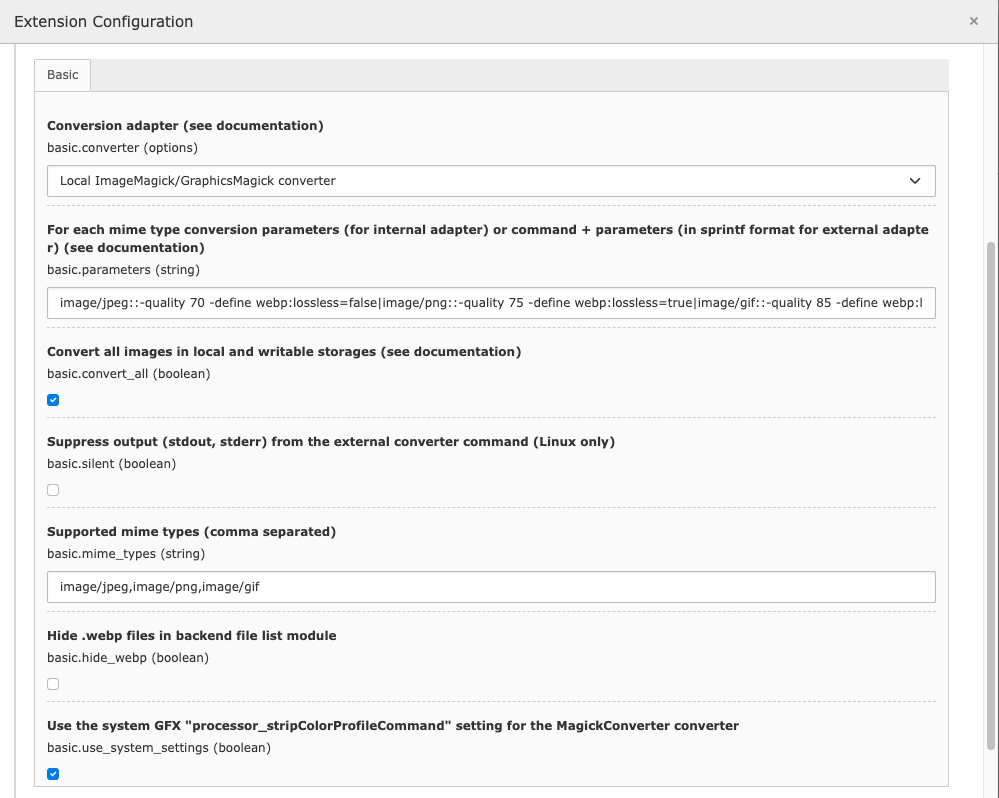
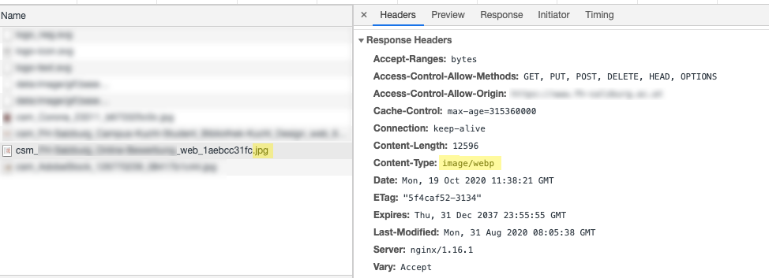

# WebP for TYPO3 CMS

Use version 2.* for TYPO3 CMS LTS 8 and 9 and >= 3.* for TYPO3 CMS >= 10.4

:fire: **If you update from a previous version to 2.0 you have to save the configuration again once!**

## What does it do?

Adds an automagically created _WebP_ copy for every processed jpg/jpeg/png/gif image in the format

    original.ext.webp
    
## What is WebP and why do I want it?

> WebP is a modern image format that provides superior lossless and lossy compression for images on the web. Using WebP, webmasters and web developers can create smaller, richer images that make the web faster.
>  
>  WebP lossless images are 26% smaller in size compared to PNGs. WebP lossy images are 25-34% smaller than comparable JPEG images at equivalent SSIM quality index.
>  
>  Lossless WebP supports transparency (also known as alpha channel) at a cost of just 22% additional bytes. For cases when lossy RGB compression is acceptable, lossy WebP also supports transparency, typically providing 3× smaller file sizes compared to PNG.

   — source: https://developers.google.com/speed/webp/

## Installation

Add via composer: 

    composer require "plan2net/webp"

* Install and activate the extension in the Extension manager 
* Flush TYPO3 and PHP Cache
* Clear the processed files in the Install Tool or Maintenance module

## Requirements

You can either use the installed Imagemagick or GraphicsMagick you already use for TYPO3 image manipulation if it supports webp (see below) or you can use any other external binary available on your server (e.g. [_cwebp_](https://developers.google.com/speed/webp/docs/cwebp)).

You can test the support of GraphicsMagick with e.g.:

    gm version | grep WebP

(should return `yes`)

or using ImageMagick with e.g.: 

    convert version | grep webp

(should return a list of supported formats including `webp`)

These are examples, check your system documentation for further information on how to verify webp support on your platform.

## Extension settings



You can set parameters for the conversion in the extension configuration. 

### `parameters`

```
parameters = image/jpeg:-quality 85 -define webp:lossless=false|image/png:-quality 75 -define webp:lossless=true|image/gif::-quality 85 -define webp:lossless=true
```

You find a list of possible options here:

https://www.imagemagick.org/script/webp.php
http://www.graphicsmagick.org/GraphicsMagick.html

If you want to use an external binary, you have to supply an option string with exactly two `%s` placeholders for the original file and the target file name.
E.g.:

```
image/jpeg::/usr/bin/cwebp -jpeg_like %s -o %s|image/png::/usr/bin/cwebp -lossless %s -o %s
```

https://developers.google.com/speed/webp/docs/cwebp

*Warning*

Try to set a higher value for `quality` first if the image does not fit your expectations,
before trying to use `webp:lossless=true`, as this could even lead to a
higher filesize than the original!

### `convert_all`

    # cat=basic; type=boolean; label=Convert all images in local and writable storage and save a copy in Webp format; disable to convert images in the _processed_ folder only
    convert_all = 1
    
Since version `1.1.0` all images in every local and writable storage will be saved as a copy in Webp format by default (instead of just images modified by TYPO3 in the storage's processed folder). If you want to revert to the previous behaviour, set this flag to `false` (disable the checkbox).

### `silent`

    # cat=basic; type=boolean; label=Suppress output (stdout, stderr) from the external converter command
    silent = 1
    
Since version `2.2.0` you can suppress output (stdout, stderr) from the external converter (Linux only).

## Webserver example configuration

Please **adapt** the following to _your specific needs_, this is **only an example** configuration.

### nginx

Add a map directive in your global nginx configuration:

    map $http_accept $webp_suffix {
        default   "";
        "~*webp"  ".webp";
    }

and add these rules to your `server` configuration:

    location ~* ^/fileadmin/.+\.(png|jpg|jpeg)$ {
            add_header Vary Accept;
            try_files $uri$webp_suffix $uri =404;
    }
    location ~* ^/other-storage/.+\.(png|jpg|jpeg|gif)$ {
            add_header Vary Accept;
            try_files $uri$webp_suffix $uri =404;
    }

Make sure that there are no other rules that already apply to the specified image formats and prevent further execution!

### Apache (.htaccess example)

    <IfModule mod_rewrite.c>
        RewriteEngine On # presumably already exists!
        
        RewriteCond %{HTTP_ACCEPT} image/webp
        RewriteCond %{REQUEST_FILENAME}\.webp -f
        RewriteRule ^ %{REQUEST_FILENAME}.webp [L]
    </IfModule>
    
Make sure that there are no other rules that already apply to the specified image formats and prevent further execution!

## Verify successful webp image generation and delivery

To make sure that everything works as expected you need to check two things:

1. WebP image generation on the webserver
2. successful delivery of WebP images to the client

### WebP image generation

Go to `fileadmin/_processed_` and check the subfolders for files with `.webp` extension. For every processed image file there should be a second file with the same filename plus `.webp` extension:

```
csm_foo-bar_4f3d6bb7d0.jpg
csm_foo-bar_4f3d6bb7d0.jpg.webp
```

### Delivery of WebP images to the client

Open a processed jpg or png image (see above) in your browser, e.g. `https://domain.tld/fileadmin/_processed_/b/2/csm_foo-bar_4f3d6bb7d0.jpg`

Check the response headers in the developer tools of your browser. Despite the file suffix `.jpg`, you should get `Content-Type: image/webp`.



## Troubleshooting and logging

If something does not work as expected take a look at the log file.
Every problem is logged to the TYPO3 log (since version 2.0), normally found in `var/log/typo3_*.log`

Converted files that are larger than the original are removed automatically (since version 2.1.0)
and the conversion will not be retried with the same configuration.

## Removing processed files

You can remove the created .webp files at any time within the TYPO3 CMS backend.

* Go to Admin Tools > Remove Temporary Assets
* Click the _Scan temporary files_ button
* In the modal click the button with the path of the storage

Although the button names only the path of the `_processed_` folder, all processed files of the storage are actually deleted!

## Alternatives

You can get an equal result with using the Apache _mod_pagespeed_ or nginx _ngx_pagespeed_ modules from Google https://developers.google.com/speed/pagespeed/module/ with a configuration like:

    pagespeed EnableFilters convert_jpeg_to_webp;
    pagespeed EnableFilters convert_to_webp_lossless;
    
but that requires more knowledge to set up.

## Drawbacks to keep in mind

Note that this extension produces an additional load on your server (each processed image is reprocessed) and possibly creates a lot of additional files that consume disk space (size varies depending on your! configuration).

## Inspiration

This extension was inspired by [Angela Dudtkowski](https://www.clickstorm.de/agentur/)'s _cs_webp_ extension that has some flaws and got no update since early 2017. Thanks Angela :-) 

## Changelog (features only, see history for bugfixes)

| Release       | Changes
| ------------- |-------------
| 1.1.0         | Convert all images in every local and writable storage<br>Fix fallback options for conversion<br>Update README
| 1.2.0         | Add options for different conversion parameters per image mimetype
| 2.0.0         | Cleanup, optimization and bugfixes. 
|               | Added logging. 
|               | :fire: Renamed configuration options. Save the configuration again once!
| 2.1.0         | Converted files larger than the original are removed and conversion will not be retried with the same configuration
| 2.2.0         | Suppress output (stdout, stderr) from the external converter command
| 3.0.0         | Drop support for TYPO3 < 10 and PHP < 7.2

## Spread some love

Send us a postcard from your favourite place and tell us how much you love TYPO3 and OpenSource:
> plan2net GmbH, Sieveringerstraße 37, 1190 Vienna, Austria

