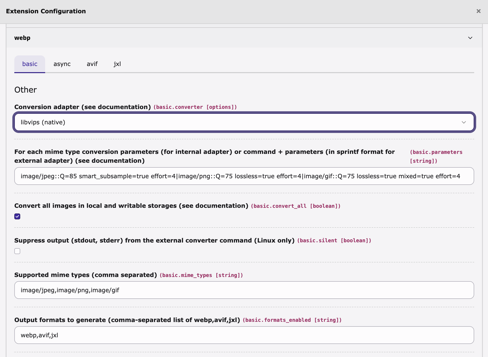
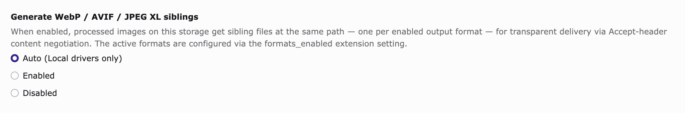
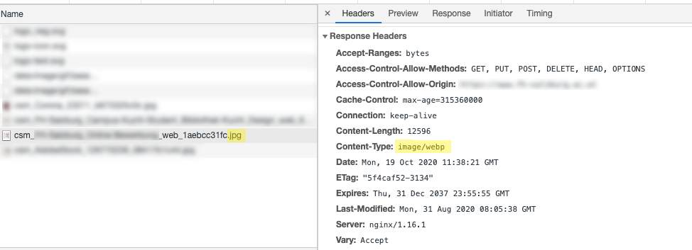

# WebP / AVIF / JPEG XL for TYPO3 CMS

[](https://packagist.org/packages/plan2net/webp)
[](https://packagist.org/packages/plan2net/webp)
[](https://github.com/plan2net/webp/actions/workflows/tests.yml)
[](https://get.typo3.org/)
[](https://packagist.org/packages/plan2net/webp)
[](LICENSE)

Serve modern image formats — **WebP, AVIF, JPEG XL** — to browsers that support them, **without changing your URLs or HTML**. The extension creates sibling files (`photo.jpg.webp`, `photo.jpg.avif`, `photo.jpg.jxl`) next to every processed image; your webserver picks the best match per request via `Accept`-header content negotiation. Browsers that don't accept any of the modern formats receive the original JPEG/PNG/GIF.

Pick any combination of formats via the [`formats_enabled`](#formats_enabled) setting. WebP is active by default.

> [!NOTE]
> The Composer package is still `plan2net/webp` and the TYPO3 extension key is still `webp` — names kept for backwards compatibility with 1.5M+ existing installs. The runtime supports all three formats regardless.

See [CHANGELOG.md](CHANGELOG.md) for release notes.

## Contents

- [Compatibility](#compatibility)
- [Requirements](#requirements)
- [Installation](#installation)
- [Updating](#updating)
- [Configuration](#configuration)
- [Async mode](#async-mode)
- [Webserver configuration](#webserver-configuration)
- [Remote storages (S3, Azure, custom FAL drivers)](#remote-storages-s3-azure-custom-fal-drivers)
- [Verifying it works](#verifying-it-works)
- [Diagnosing your installation](#diagnosing-your-installation)
- [Troubleshooting](#troubleshooting)
- [Known limitations](#known-limitations)

## When to use this vs. TYPO3 14 native WebP

TYPO3 v14 introduced native WebP support via `$GLOBALS['TYPO3_CONF_VARS']['GFX']['imageFileConversionFormats']`. The core mechanism converts processed image **output** to WebP: the processed file's extension is `.webp` and the URL changes accordingly (`photo.jpg` → `photo.webp`). It's WebP-only.

This extension solves a different problem and supports all three formats:

| Concern                                                | This extension                                                                                  | TYPO3 v14 native              |
|--------------------------------------------------------|-------------------------------------------------------------------------------------------------|-------------------------------|
| Formats supported                                      | WebP, AVIF, JPEG XL                                                                             | WebP only                     |
| URL of served image                                    | Unchanged (`photo.jpg`)                                                                         | Changed (`photo.webp`)        |
| HTML / templates                                       | Unchanged                                                                                       | Reference new URL             |
| Fallback for browsers that lack the served format      | Transparent via webserver                                                                       | Need `<picture>` or polyfill  |
| Requires webserver rewrite rule                        | Yes                                                                                             | No                            |
| Works with cached HTML / CDN URLs                      | Yes                                                                                             | Cache invalidation needed     |

Use the core mechanism if you can change URLs and only need WebP. Use this extension if URLs must stay stable, or you want AVIF/JPEG XL alongside WebP.

## About the formats

| Format       | Released | Coverage (May 2026)¹ | Typical size² | Notes |
|--------------|----------|----------------------|---------------|-------|
| **WebP**     | 2010     | ~95.6%               | −25 to −34% vs JPEG; −26% vs PNG | Mature; broadest browser support |
| **AVIF**     | 2019     | ~94%                 | ~−20 to −30% vs WebP at equal SSIM | AV1-based; supported by Chrome 85+, Firefox 93+, Safari 16+ |
| **JPEG XL**  | 2022     | ~17%                 | Comparable to AVIF, often better at lossless | Supported by Safari 17+; coverage growing |

- ¹ caniuse.com, StatCounter data, April 2026.
- ² Per Google reference numbers and AVIF benchmark suites; real-world savings vary with content.

All three support lossy and lossless modes, transparency, and ICC color profiles. WebP and the libvips path also support animation; AVIF and JPEG XL animation depend on the chosen converter.

Smaller image payloads improve Core Web Vitals directly. Largest Contentful Paint (LCP) benefits most: image bytes shrink while rendered dimensions stay the same. A 25–34% bandwidth reduction adds up on image-heavy pages and mobile connections.

### Converter × format support matrix

Pick a converter per format that matches what's actually installed on the host. The four built-in converters cover the cross-product like this:

| Converter           | webp | avif | jxl |
|---------------------|------|------|-----|
| `VipsConverter`     | ✓    | ✓¹   | ✓²  |
| `MagickConverter`   | ✓    | ✓³   | ✓⁴  |
| `ExternalConverter` | ✓    | ✓⁵   | ✓⁶  |
| `PhpGdConverter`    | ✓    | ✗    | ✗   |

- ¹ libvips built with libheif (AV1 encoder)
- ² libvips built with libjxl
- ³ ImageMagick with libheif AV1 delegate
- ⁴ ImageMagick 7+ with libjxl delegate
- ⁵ command-defined, e.g. `avifenc`
- ⁶ command-defined, e.g. `cjxl`

`webp:diagnose` verifies per-format delegate availability — see [Diagnosing your installation](#diagnosing-your-installation).

## Compatibility

| Extension version | TYPO3              | PHP            | Status   |
|-------------------|--------------------|----------------|----------|
| 14.x              | 12.4, 13.4, 14.x   | 8.2, 8.3, 8.4  | Current  |
| 13.x              | 13.4               | 8.2, 8.3       | Legacy   |
| 5.x               | 12.4               | 8.1, 8.2       | Legacy   |

## Requirements

You need an image converter on the host that can write the output formats you enable. The extension ships four converter backends — pick whichever fits your stack from the matrix above.

For the WebP-only default install:

- **ImageMagick** or **GraphicsMagick** compiled with WebP delegate, **or**
- **PHP GD** with the `IMG_WEBP` flag at runtime, **or**
- **libvips** in-process via [`jcupitt/vips`](https://packagist.org/packages/jcupitt/vips) + PHP `ext-ffi`, **or**
- Any other external WebP encoder such as [`cwebp`](https://developers.google.com/speed/webp/docs/cwebp).

For **AVIF** and **JPEG XL** you additionally need:

- **libvips** built with libheif (AVIF) and/or libjxl (JPEG XL) — the simplest path; one `apt install libvips-tools libheif1 libjxl-tools` covers both, plus `composer require jcupitt/vips`.
- **OR ImageMagick** with the matching delegates (`libheif` with the AV1 encoder for AVIF, `libjxl` for JPEG XL).
- **OR external encoders** like `avifenc` (libavif) and `cjxl` (libjxl) wired through `ExternalConverter`.

Verify your existing setup:

```sh
# GraphicsMagick — should return "yes" for any format you've enabled
gm version | grep -iE "webp|heif|jxl"

# ImageMagick — listed AVIF / JXL should be flagged "rw" (read+write)
convert -list format | grep -iE "WEBP|AVIF|JXL"
```

`webp:diagnose` runs the equivalent checks for the currently-configured converter per format — see [Diagnosing your installation](#diagnosing-your-installation).

## Installation

```sh
composer require plan2net/webp
```

Then:

1. Activate the extension if your TYPO3 is in non-Composer mode (Composer mode activates it automatically).
2. Flush TYPO3 and PHP caches.
3. Clear processed files (*System → Maintenance → Remove Temporary Assets* on TYPO3 v14; *Admin Tools → Maintenance* on v12/v13).
4. Add the [webserver rewrite rules](#webserver-configuration).

## Updating

After a `composer update`, **save the extension settings at least once** via the Extension Configuration backend module (*System → Settings → Extension Configuration → webp* on TYPO3 v14; *Admin Tools → Settings → Extension Configuration → webp* on v12/v13). TYPO3 only writes default values to `LocalConfiguration` when you save the settings form, so any new defaults the upgraded version ships won't take effect until you do.

### Upgrading to multi-format output

Existing installs keep generating WebP only because `formats_enabled` defaults to `webp`. To enable AVIF or JPEG XL:

1. Run the TYPO3 database analyzer once — `tx_webp_queue` and `tx_webp_failed` gain a `format` column with default `'webp'`, so existing rows remain valid without a data migration.
2. Open the AVIF (or JXL) tab in the Extension Configuration, fill in `converter_avif` + `parameters_avif` + `mime_types_avif`, and add the format name to `formats_enabled` (e.g. `webp,avif`).
3. Update the webserver rewrite rules to serve the new sibling — see [Webserver configuration](#webserver-configuration). Without that update, AVIF/JXL siblings sit on disk unused.

3rd-party custom converters that implement only `Plan2net\Webp\Converter\Converter` continue to work for the WebP slot. To opt them into AVIF or JXL, implement `Plan2net\Webp\Converter\MultiFormatConverter` (a separate interface that takes the format as a 3rd argument) — or extend `Plan2net\Webp\Converter\AbstractConverter`, which now provides both.

## Configuration



| Setting                                       | Default                                     | Purpose                                                |
|-----------------------------------------------|---------------------------------------------|--------------------------------------------------------|
| [`async`](#async)                             | `0`                                         | Queue conversions for a scheduler worker instead of running them on the page-render path |
| [`async_throttle_ms`](#async_throttle_ms)     | `0`                                         | Random per-conversion sleep (ms) in the worker; 0 disables |
| [`convert_all`](#convert_all)                 | `1`                                         | Convert all images, not just `_processed_`             |
| [`exclude_directories`](#exclude_directories) | _(empty)_                                   | Skip processing for matching paths                     |
| [`filter_pattern`](#filter_pattern)           | `/\.(jpe?g\|png\|gif)\.(webp\|avif\|jxl)$/i`| PCRE for which siblings to hide (only when `hide_webp`) |
| [`formats_enabled`](#formats_enabled)         | `webp`                                      | Output formats to generate, comma list of `webp,avif,jxl` |
| [`hide_webp`](#hide_webp)                     | `1`                                         | Hide generated sibling files (`.webp` / `.avif` / `.jxl`) in the BE file list |
| [`mime_types`](#mime_types)                   | `image/jpeg,image/png,image/gif`            | Source mime types convertible to `webp`                |
| [`parameters`](#parameters)                   | See below                                   | Per-mime-type WebP converter parameters (the `webp` slot) |
| [`parameters_avif`](#parameters_avif)         | See below                                   | Per-mime-type AVIF converter parameters                 |
| [`parameters_jxl`](#parameters_jxl)           | See below                                   | Per-mime-type JPEG XL converter parameters              |
| [`silent`](#silent)                           | `1`                                         | Suppress converter stdout/stderr (Linux only)          |
| [`use_system_settings`](#use_system_settings) | `1`                                         | Reuse GFX color profile settings (MagickConverter)     |

Each non-webp format adds its own `converter_<format>`, `parameters_<format>`, and `mime_types_<format>` settings in dedicated `cat=avif` / `cat=jxl` tabs of the Extension Configuration form. See [`formats_enabled`](#formats_enabled) and the per-format `parameters_avif` / `parameters_jxl` sections below.

### `async`

```
# cat=async; type=boolean; label=Enable asynchronous conversion
async = 0
```

When enabled, the `AfterFileProcessing` listener writes a row to `tx_webp_queue` instead of running the converter inside the request. Conversions then happen out-of-band via the `webp:process-queue` CLI command, typically registered as a TYPO3 Scheduler task. See [Async mode](#async-mode) below for setup.

When disabled (default), conversions run synchronously exactly as before.

### `async_throttle_ms`

```
# cat=async; type=int+; label=Random sleep (ms) between conversions
async_throttle_ms = 0
```

Pause for a random interval between conversions inside the worker. Value `0` means no pause. Value `N > 0` means each pause is `random(N/2, N*3/2)` milliseconds, so a batch of conversions doesn't saturate CPU in lock-step. Applies to both queue mode and `--folder` mode.

### `convert_all`

```
# cat=basic; type=boolean; label=Convert all images in local and writable storage and save a copy in Webp format; disable to convert images in the _processed_ folder only
convert_all = 1
```

When enabled (default), every image in every local + writable storage gets siblings (in every enabled format) — not just images that TYPO3 has actually processed into `_processed_/`. To revert to processing-only behaviour, disable the checkbox.

Source-folder siblings are kept in sync with TYPO3's FAL operations: moving an image moves all its siblings (`.webp`/`.avif`/`.jxl`), deleting removes them, replacing drops the stale set so the next render produces fresh ones. When a storage has a recycler, the siblings follow the file into the recycler so restore keeps the set intact. No configuration needed.

### `exclude_directories`

```
# cat=basic; type=string; label=Exclude processing of images from specific directories (separated by semicolon)
exclude_directories =
```

Skip processing for images under any of the listed paths (semicolon-separated).

Example: `/fileadmin/demo/special;/another-storage/demo/exclusive`

### `filter_pattern`

```
# cat=basic; type=string; label=Pattern to filter out files
filter_pattern = /\.(jpe?g|png|gif)\.(webp|avif|jxl)$/i
```

PCRE pattern matched against the file identifier when [`hide_webp`](#hide_webp) is enabled. The default matches the sibling-file naming this extension produces (`photo.jpg.webp`, `photo.jpg.avif`, `photo.jpg.jxl`) without hiding standalone `.webp` / `.avif` / `.jxl` files. Override if you use a custom naming scheme.

Invalid patterns are silently ignored (no files are hidden, no errors raised).

### `formats_enabled`

```
# cat=basic; type=string; label=Output formats to generate (comma-separated list of webp,avif,jxl)
formats_enabled = webp
```

Comma-separated list of output formats this install should produce. Each enabled format generates its own sibling next to the original (and its own row in `sys_file_processedfile`). Set to `webp,avif` to ship both kinds of siblings, `avif,jxl,webp` to ship all three.

Each non-webp format reads its converter and parameters from per-format keys (in their own `cat=avif` / `cat=jxl` tabs in the Extension Configuration form):

- `converter_avif`, [`parameters_avif`](#parameters_avif), `mime_types_avif`
- `converter_jxl`, [`parameters_jxl`](#parameters_jxl), `mime_types_jxl`

The legacy `converter` + `parameters` + `mime_types` keys remain the source of truth for the WebP slot.

Both `parameters_avif` and `parameters_jxl` ship with ImageMagick-compatible defaults so enabling a format works out of the box on the typical TYPO3 host. Tune to your stack — recipes for libvips and external binaries are under [`parameters_avif`](#parameters_avif) and [`parameters_jxl`](#parameters_jxl) below.

### `hide_webp`

```
# cat=basic; type=boolean; label=Hide sibling files (.webp/.avif/.jxl) matching the filter pattern in backend file list module
hide_webp = 1
```

Hides generated sibling files (`.webp`, `.avif`, `.jxl`) in the backend file list module. The pattern controlling **which** files are hidden is [`filter_pattern`](#filter_pattern).

> [!NOTE]
> The setting key is `hide_webp` for backwards compatibility with installs that wrote it before AVIF/JPEG XL existed; semantically it covers all sibling formats.

For a more customised behaviour (e.g. show siblings only to a specific BE group), override `$GLOBALS['TYPO3_CONF_VARS']['SYS']['fal']['defaultFilterCallbacks']` in your own extension — see `ext_localconf.php` for the registration this extension performs.

### `mime_types`

```
# cat=basic; type=string; label=Supported mime types (comma separated)
mime_types = image/jpeg,image/png,image/gif
```

Only source files whose mime type is in this comma-separated list are considered for conversion to the WebP slot. AVIF and JPEG XL have their own per-format `mime_types_avif` / `mime_types_jxl` lists.

### `parameters`

Each entry is `mime/type::params`, separated by `|`. The `::` is significant — a single colon doesn't match, and the value is then treated as default parameters for any mime type.

Default (ImageMagick/GraphicsMagick):

```
parameters = image/jpeg::-quality 85 -define webp:lossless=false|image/png::-quality 75 -define webp:lossless=true|image/gif::-quality 85 -define webp:lossless=true
```

Per-mime-type breakdown:

| Mime type    | Default parameters                          |
|--------------|---------------------------------------------|
| `image/jpeg` | `-quality 85 -define webp:lossless=false`   |
| `image/png`  | `-quality 75 -define webp:lossless=true`    |
| `image/gif`  | `-quality 85 -define webp:lossless=true`    |

Reference:

- [ImageMagick WebP options](https://www.imagemagick.org/script/webp.php)
- [GraphicsMagick options](http://www.graphicsmagick.org/GraphicsMagick.html)

> [!WARNING]
> Try raising `quality` before reaching for `webp:lossless=true`; lossless can produce files *larger* than the original.

#### Using an external binary

Supply a command string with exactly two `%s` placeholders for the source and target file:

```
image/jpeg::/usr/bin/cwebp -jpeg_like %s -o %s|image/png::/usr/bin/cwebp -lossless %s -o %s|image/gif::/usr/bin/gif2webp %s -o %s
```

See [`cwebp` documentation](https://developers.google.com/speed/webp/docs/cwebp).

With libvips's `vips` CLI binary:

```
image/jpeg::/usr/bin/vips webpsave %s %s --Q 85 --effort 4 --smart-subsample|image/png::/usr/bin/vips webpsave %s %s --Q 75 --lossless --effort 4|image/gif::/usr/bin/vips webpsave %s[n=-1] %s --Q 75 --lossless --effort 4 --mixed
```

The GIF entry uses `%s[n=-1]` on the source so libvips reads all frames; without it only the first frame survives and `--mixed` (a save-side option) can't recover the rest. See the [libvips CLI reference](https://www.libvips.org/API/current/using-the-cli.html).

#### Using libvips natively

Pick **libvips (native)** from the converter dropdown for the fastest path: 2–3× faster than MagickConverter at equivalent quality, substantially less memory, and animated GIFs survive as animated WebP automatically.

Install the libvips shared library, enable PHP's FFI extension, and require the PHP binding:

```sh
apt install libvips-tools           # Debian/Ubuntu — pulls in libvips42 / libvips42t64
brew install vips                   # macOS
composer require jcupitt/vips
```

Set `parameters` to:

```
image/jpeg::Q=85 smart_subsample=true effort=4|image/png::Q=75 lossless=true effort=4|image/gif::Q=75 lossless=true mixed=true effort=4
```

Options are passed straight to libvips's `webpsave` — see the [option reference](https://www.libvips.org/API/current/VipsForeignSave.html#vips-webpsave) for the full list.

> [!IMPORTANT]
> Set `ffi.enable=true` in php.ini (not `preload` — jcupitt/vips does not support FFI preloading). On PHP 8.3+ also set `zend.max_allowed_stack_size=-1`; without it the default stack limit can cause spurious conversion failures.

### `parameters_avif`

Same `mime/type::params|…` syntax as [`parameters`](#parameters). Default targets ImageMagick (matches the default `converter_avif`):

```
parameters_avif = image/jpeg::-quality 60|image/png::-quality 75|image/gif::-quality 60
```

| Backend             | Recommended `parameters_avif`                                                          |
|---------------------|----------------------------------------------------------------------------------------|
| `MagickConverter`   | `image/jpeg::-quality 60\|image/png::-quality 75\|image/gif::-quality 60`              |
| `VipsConverter`     | `image/jpeg::Q=60 effort=4\|image/png::Q=60 effort=4\|image/gif::Q=60 effort=4`        |
| `ExternalConverter` | `image/jpeg::/usr/bin/avifenc --min 30 --max 50 %s %s\|image/png::…\|image/gif::…`     |

AVIF at quality ~60 typically matches WebP at quality ~85 in filesize, often at better SSIM. For ImageMagick, `-quality` covers the common case; advanced encoders also accept `-define heic:speed=2` (slower, better compression) on builds with the libheif AV1 delegate.

References:

- [libheif AV1 encoder options](https://github.com/strukturag/libheif/blob/master/aom-options.md) (used by ImageMagick when compiled with libheif)
- [libvips `heifsave` reference](https://www.libvips.org/API/current/VipsForeignSave.html#vips-heifsave) (the libvips AVIF entry point)
- [`avifenc`](https://github.com/AOMediaCodec/libavif#installation) command-line flags

`webp:diagnose` reports per-mime-type parameter resolution; if you enable AVIF and leave entries missing, it tells you which lines to add.

### `parameters_jxl`

Same syntax. Default targets ImageMagick:

```
parameters_jxl = image/jpeg::-quality 75|image/png::-quality 90|image/gif::-quality 75
```

| Backend             | Recommended `parameters_jxl`                                                                       |
|---------------------|----------------------------------------------------------------------------------------------------|
| `MagickConverter`   | `image/jpeg::-quality 75\|image/png::-quality 90\|image/gif::-quality 75`                          |
| `VipsConverter`     | `image/jpeg::Q=75 effort=7\|image/png::lossless=true effort=7\|image/gif::lossless=true effort=7`  |
| `ExternalConverter` | `image/jpeg::/usr/bin/cjxl --quality 75 %s %s\|image/png::/usr/bin/cjxl --lossless_jpeg=0 %s %s\|…`|

JXL preserves PNG well in modular (lossless) mode — for `image/png`, prefer a higher quality value (or `lossless=true` on libvips) than for JPEG.

References:

- [libjxl encoder options](https://github.com/libjxl/libjxl/blob/main/doc/man/cjxl.txt)
- [libvips `jxlsave` reference](https://www.libvips.org/API/current/VipsForeignSave.html#vips-jxlsave)

### `silent`

```
# cat=basic; type=boolean; label=Suppress output (stdout, stderr) from the external converter command
silent = 1
```

Suppress stdout/stderr from external converters. Linux only.

### `use_system_settings`

```
# cat=basic; type=boolean; label=Use the system GFX "processor_stripColorProfileCommand"/"processor_stripColorProfileParameters" setting for the MagickConverter converter
use_system_settings = 1
```

Applies only to `MagickConverter`. When enabled, the value of `$GLOBALS['TYPO3_CONF_VARS']['GFX']['processor_stripColorProfileCommand']` and `processor_stripColorProfileParameters` is appended to converter arguments automatically — no need to repeat the setting per mime type.

`PhpGdConverter` and external-binary configurations ignore this flag.

## Async mode

By default the extension converts images synchronously inside the request that processes the source file. On image-heavy pages or large-fileadmin sites this adds latency to every render. Enabling `async = 1` moves the conversion off the render path:

1. Set `async = 1` in the extension configuration.
2. Run TYPO3's database analyzer so `tx_webp_queue` is created.
3. Register a TYPO3 Scheduler task: **System → Scheduler → Add task → Type: "Process conversion queue (webp)"**. Pick a frequency that matches your throughput (every minute for busy sites, hourly for low-traffic).
4. Make sure the scheduler itself runs — either via `vendor/bin/typo3 scheduler:run` in cron, or a daemonized runner.

From now on the listener queues new conversions and the scheduler runs them in the background. Existing siblings keep working; images that don't have one yet get converted the next time they're rendered.

### Sweeping non-FAL folders

Some image folders (notably `typo3temp/assets/online_media/` for YouTube/Vimeo preview thumbnails) live outside TYPO3's File Abstraction Layer, so the listener never sees them. The `--folder` argument bypasses the queue and converts files directly:

```sh
vendor/bin/typo3 webp:process-queue --folder=typo3temp/assets/online_media/
```

Register this as a second Scheduler task ("Execute console command") if you want it to run periodically. Paths resolve relative to the public web root and are restricted to it for safety.

## Webserver configuration

The webserver inspects the client's `Accept` header and rewrites the request to the best-matching sibling that's available on disk. If only WebP is enabled, the server has two candidates: serve `.webp` when the client accepts it, otherwise fall back to the original JPEG/PNG/GIF. With AVIF or JPEG XL enabled too, the server picks among the available siblings in client-preference order.

Below are examples for nginx and Apache. **Adapt them to your stack** — these aren't drop-in copies. The E2E suite runs minimal complete configs for both servers: [nginx.conf](Tests/E2E/nginx.conf) and [apache.conf](Tests/E2E/apache.conf).

> [!IMPORTANT]
> Make sure no earlier rule in your config short-circuits the request for the image extensions you target (e.g. a generic static-asset block). If so, move the sibling-rewrite rules above it or rework the earlier rule.

### nginx

Add a `map` directive in the `http` block. Order matters — the first match wins, so list the formats in preference order (AVIF first, WebP next, JXL last):

```nginx
map $http_accept $sibling_suffix {
    default        "";
    "~*image/avif" ".avif";
    "~*image/webp" ".webp";
    "~*image/jxl"  ".jxl";
}
```

If you only generate `.webp`, the map can be the single-line `"~*webp" ".webp";` variant — clients never ask for `image/avif` from a server that doesn't offer it.

If you front the site with Cloudflare, prefer this variant — Cloudflare caches per response and would otherwise mix the variants:

```nginx
map $http_accept $sibling_suffix_raw {
    default        "";
    "~*image/avif" ".avif";
    "~*image/webp" ".webp";
    "~*image/jxl"  ".jxl";
}
map $http_cf_cache_status $iscf {
    default   1;
    ""        0;
}
# Suppress the sibling whenever Cloudflare is in front (iscf=1). Composite key
# is "<iscf><suffix>": "0.avif" serves AVIF directly, "1.avif" serves the
# original. Every iscf=1 case falls through `default ""`.
map $iscf$sibling_suffix_raw $sibling_suffix {
    default   "";
    "0.avif"  ".avif";
    "0.webp"  ".webp";
    "0.jxl"   ".jxl";
}
```

Add the location block to your `server`:

```nginx
location ~* ^.+\.(png|gif|jpe?g)$ {
    add_header Vary "Accept";
    add_header Cache-Control "public, no-transform";
    try_files $uri$sibling_suffix $uri =404;
}
```

#### Restrict by user agent (optional)

```nginx
location ~* ^.+\.(png|gif|jpe?g)$ {
    if ($http_user_agent !~* (Chrome|Firefox|Edge)) {
        set $sibling_suffix "";
    }
    …
}
```

### Apache

The first two directives are already part of TYPO3's default `.htaccess` template (`typo3/sysext/install/Resources/Private/FolderStructureTemplateFiles/root-htaccess`); they're shown here for completeness. Assume `mod_rewrite.c` is enabled.

```apache
RewriteEngine On
AddType image/webp .webp
AddType image/avif .avif
AddType image/jxl  .jxl

# AVIF preferred over WebP — order matters, first matching rule wins.
RewriteCond %{HTTP_ACCEPT} image/avif
RewriteCond %{REQUEST_FILENAME} (.*)\.(?i:png|gif|jpe?g)$
RewriteCond %{REQUEST_FILENAME}\.avif -f
RewriteRule ^ %{REQUEST_FILENAME}\.avif [L,T=image/avif]

RewriteCond %{HTTP_ACCEPT} image/webp
RewriteCond %{REQUEST_FILENAME} (.*)\.(?i:png|gif|jpe?g)$
RewriteCond %{REQUEST_FILENAME}\.webp -f
RewriteRule ^ %{REQUEST_FILENAME}\.webp [L,T=image/webp]

RewriteCond %{HTTP_ACCEPT} image/jxl
RewriteCond %{REQUEST_FILENAME} (.*)\.(?i:png|gif|jpe?g)$
RewriteCond %{REQUEST_FILENAME}\.jxl -f
RewriteRule ^ %{REQUEST_FILENAME}\.jxl [L,T=image/jxl]

<IfModule mod_headers.c>
    <FilesMatch "\.(png|gif|jpe?g)$">
        Header append Vary Accept
    </FilesMatch>
</IfModule>
```

If you only generate `.webp` (default `formats_enabled = webp`), keep just the WebP block and drop the AVIF/JXL ones.

#### When `%{REQUEST_FILENAME}` doesn't resolve

Some environments — shared hosting (IONOS etc.), Windows Apache, or setups where the rewrite runs before path resolution — return 403/404 with the `%{REQUEST_FILENAME}` form because Apache can't map the request to a filesystem path at that stage. Two portable alternatives:

```apache
RewriteRule ^ %{REQUEST_URI}.webp [L,T=image/webp]
```

or:

```apache
RewriteRule ^(.*)$ $1.webp [L,T=image/webp]
```

Substitute either for the `RewriteRule ^ %{REQUEST_FILENAME}\.webp …` line above.

#### Restrict by user agent (optional)

```apache
RewriteCond %{HTTP_ACCEPT} image/webp
RewriteCond %{HTTP_USER_AGENT} ^.*(Chrome|Firefox|Edge).*$ [NC]
…
```

## Remote storages (S3, Azure, custom FAL drivers)



Out of the box every Local writable storage produces sibling files — that's
the default mode for the *Generate WebP / AVIF / JPEG XL siblings* field on each storage
record. To opt in a non-Local storage (S3 mount, Azure mount, any custom FAL
driver), edit the storage record and set the field to **Enabled**.

| Value | Result |
|---|---|
| **Auto** *(default)* | On for `driver = Local`, off for everything else. Identical to pre-14.2 behaviour. |
| **Enabled**          | On regardless of driver type. Use to opt a remote storage in. |
| **Disabled**         | Off regardless of driver type. Use to take a Local storage out of the pipeline temporarily. |

Once enabled, behaviour is identical to a Local storage: every sibling lands at
`<original>.<format>` on the storage, and the four FAL lifecycle events (move,
replace, delete, recycler) keep all siblings in sync.

> [!IMPORTANT]
> Enable [`async = 1`](#async) for any storage with a non-Local driver.
> Synchronous mode adds the driver's upload latency to every page render that
> processes an image (typical S3 PUT: 100–500 ms, more on cold connections).
> The async queue moves that work off the render path.

### Serving the right format on a CDN

This extension *writes* the siblings on the storage. Serving the right one
per request — the `Accept`-header rewrite — is the edge's job. Sketches:

- **CloudFront**: attach a CloudFront Function on viewer request that
  inspects `Accept`. Pick `.avif` if present, fall through to `.webp`, fall
  through to `.jxl` for clients that prefer it (Safari 17+), otherwise serve
  the original. Pair with a viewer-response function that sets `Vary: Accept`.
- **Cloudflare**: a Worker doing the same priority lookup, or an Image
  Resizing policy if the account has it.
- **Direct S3 origins without an edge function**: not supported by S3 itself;
  you need a layer in front (CloudFront/equivalent or an origin proxy).

The webserver-rewrite recipes above still apply when TYPO3's origin sits in
front of the storage (e.g., S3 mounted only for backend uploads, but served
through the TYPO3 instance).

## Verifying it works

Two things to check: that sibling files are actually generated for every format you enabled, and that the webserver serves the right one when the client supports it.

### Sibling file generation

Browse to `fileadmin/_processed_` and look for siblings next to processed variants:

```
csm_foo-bar_4f3d6bb7d0.jpg            ← TYPO3 variant
csm_foo-bar_4f3d6bb7d0.jpg.webp       ← formats_enabled contains webp
csm_foo-bar_4f3d6bb7d0.jpg.avif       ← formats_enabled contains avif
csm_foo-bar_4f3d6bb7d0.jpg.jxl        ← formats_enabled contains jxl
```

With `convert_all = 1`, you'll also find siblings next to originals in `fileadmin/` itself.

### Delivery

Request a JPEG/PNG with an `Accept` header for each enabled format:

```sh
# Expect Content-Type matching the highest-priority enabled format the client asked for:
curl -H "Accept: image/avif,image/webp,image/jxl" -I https://example.tld/fileadmin/_processed_/b/2/csm_foo-bar_4f3d6bb7d0.jpg
# expect: Content-Type: image/avif   (or image/webp if only webp is enabled, etc.)
```

Or open the URL in a browser and check the response headers in the developer tools — despite the `.jpg` suffix the `Content-Type` should be one of the modern formats:



## Diagnosing your installation

The `webp:diagnose` CLI command walks the full delivery chain end-to-end — across every enabled output format — and points at the first failing link.

```bash
vendor/bin/typo3 webp:diagnose                              # health check
vendor/bin/typo3 webp:diagnose --url=https://example.com    # also probe webserver delivery
vendor/bin/typo3 webp:diagnose --file=42                    # also investigate one file
vendor/bin/typo3 webp:diagnose --format=avif                # limit the report to one format
```

It reports per enabled format:

- Storages: mode, driver, per-format sibling count, plus phantom rows with unregistered drivers.
- Converter: class, per-format delegate availability (`convert -list format` for Magick; `vips_foreign_find_save` for libvips), parameter parsing.
- Async pipeline: per-format queue size + oldest age, scheduler task state.
- Failed-conversion cache: per-format totals, recent rows, dominant config hash.
- Delivery probe (`--url=…`): four `Accept` HEADs (avif / jxl / webp / `*/*`) compared against `expectedTopFormat`, plus `Vary: Accept`.
- File deep dive (`--file=<uid>`): metadata + per-format sibling presence (source-folder and processed-folder) + per-format failed-attempts rows.

**Limitation:** the probe runs from this machine. CDN behaviour at the edge can differ from what you observe locally. Run the probe from a host inside your CDN's pull zone for the most accurate read.

Useful flags:

| Flag | Purpose |
|---|---|
| `--format=<webp\|avif\|jxl>` | Limit the report to one output format |
| `--insecure` | Disable TLS certificate verification on the HTTP probe — for self-signed or otherwise untrusted certs |
| `--probe-timeout=<sec>` | HTTP probe timeout (default: 10) |

## Troubleshooting

Every conversion problem is logged to TYPO3's log (`var/log/typo3_*.log` by default). Start there.

Common cases:

| Symptom                                                | Likely cause                                                                 |
|--------------------------------------------------------|------------------------------------------------------------------------------|
| No sibling files appear in `_processed_/`              | Converter binary lacks the delegate for the enabled format(s) (`webp:diagnose` reports this), or `mime_types_<format>` excludes the source |
| Files are bigger than the original                     | Automatically removed and **not retried** with the same configuration         |
| Output renders darker / off-colour                     | `$GLOBALS['TYPO3_CONF_VARS']['GFX']['processor_colorspace']` (e.g. `sRGB`)    |
| Apache rewrite returns 403/404                         | [`%{REQUEST_FILENAME}` doesn't resolve](#when-request_filename-doesnt-resolve) |
| File still served as JPEG after a successful generation | Webserver rewrite rule missing or shadowed by another rule                  |
| Only one format is served when several are enabled     | Rewrite rule lists the formats in the wrong priority order — AVIF should come before WebP, see [Webserver configuration](#webserver-configuration) |
| Sibling left behind after deleting the source          | None — fixed in 14.0.0; upgrade                                              |

After changing `processor_colorspace`, clean up any processed files via the Maintenance backend module (*System → Maintenance → Remove Temporary Assets* on TYPO3 v14; *Admin Tools → Maintenance* on v12/v13) so the change takes effect on existing images.

## Known limitations

- **Animated GIFs.** Only the libvips routes preserve animation: `VipsConverter` does it automatically, and the `vips` CLI route requires `%s[n=-1]` on the GIF source argument (see [`parameters`](#parameters)). `MagickConverter`, `PhpGdConverter`, and `cwebp`-based configurations produce single-frame output. For AVIF and JPEG XL siblings, animation preservation depends on the chosen converter and is not exercised by the test suite.
- **The image processor must be compiled with the right delegate for each enabled format.** WebP needs the libwebp delegate; AVIF needs libheif with an AV1 encoder; JPEG XL needs libjxl. See [Requirements](#requirements).
- **Cross-storage FAL moves are not handled.** If you move a file between two different storages, the sibling at the source storage is left orphaned. Lazy regeneration handles the target storage on next render. Single-storage moves work correctly.
- **`use_system_settings` only applies to `MagickConverter`.** `PhpGdConverter` and external-binary configurations ignore it.

## Maintenance

To remove all generated sibling files (e.g. before a converter or quality change):

1. *System → Maintenance → Remove Temporary Assets* (TYPO3 v14) or *Admin Tools → Maintenance → Remove Temporary Assets* (v12/v13).
2. Click *Scan temporary files*.
3. Click the button labelled with the storage path.

The button label only mentions `_processed_/`, but all processed files in the storage are removed — including every format's sibling.

The next page render will regenerate siblings for every currently-enabled format using the current configuration.

## Drawbacks

- **Extra CPU.** Every processed image is reprocessed once per enabled output format. The work happens once per (image × format) pair (results are cached on disk) but adds latency to first-time renders. AVIF and JPEG XL encoders are slower than WebP; budget CPU accordingly when enabling them.
- **Extra disk.** Each enabled format adds one sibling per source image. Typical relative sizes vs the original:
  - WebP: ~65–75% (Google's reference numbers — lossy WebP is 25–34% smaller than JPEG; lossless is 26% smaller than PNG)
  - AVIF: ~45–55% at equal SSIM
  - JPEG XL: comparable to AVIF, often better on lossless content

  With `convert_all = 1` enabled this applies to every source image, not just processed variants — and is multiplied by the number of enabled formats.

## Alternatives

- **TYPO3 v14 native WebP** — see [the comparison above](#when-to-use-this-vs-typo3-14-native-webp). Best fit when you can change URLs.
- **Apache `mod_pagespeed` / nginx `ngx_pagespeed`** — Google's automatic image-rewriting modules. Equal end-result with `pagespeed EnableFilters convert_jpeg_to_webp;` plus `convert_to_webp_lossless;`, but more involved to set up and operate.
- **Cloudflare Polish** or similar CDN-level image optimisation.

## Credits

Inspired by [Angela Dudtkowski](https://www.clickstorm.de/agentur/)'s `cs_webp` extension. Thanks Angela.

Thanks to Xavier Perseguers for the Cloudflare hint and to Marcus Förster for simplifying the Apache rewrite rules.

## License

GPL-3.0-or-later — see [LICENSE](LICENSE).

## Spread some love

Send us a postcard from your favourite place and tell us how much you love TYPO3 and OpenSource:

> plan2net GmbH
> Sieveringerstraße 37
> 1190 Vienna, Austria
